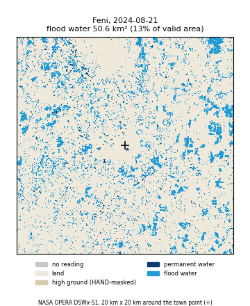
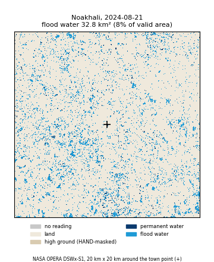
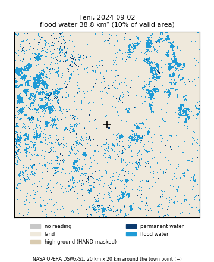
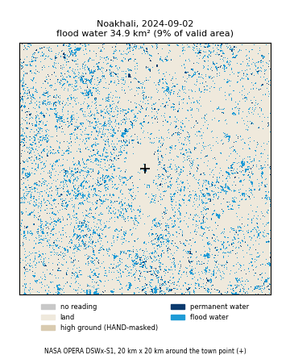
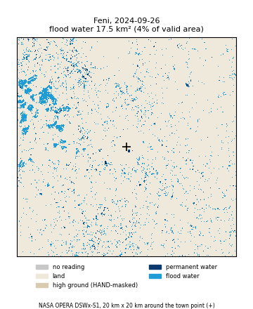
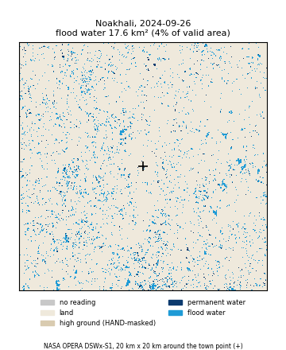
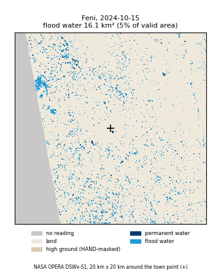
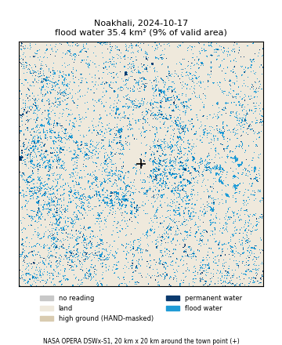

# Post-flood recovery clock (Tasks 7a and 7a-2)

Generated by `src/compute/post_flood.py` and `scripts/fetch_dswx.py --area`
(via a one-off analysis script; every number here can be reproduced by
calling `smap_days_to_normal()`, `flood_recession()` and
`earliest_sowing_date()` on the files under "Data used"). Do not edit the
numbers by hand.

This answers one question for a flooded plot: **when can it be sown again?**
Two independent NASA signals, combined:

- **SMAP root-zone soil moisture** says when the soil is dry enough. "Normal"
  for a given calendar day is the 80th percentile of that day (+/- 15 days)
  across every *other* year on record, held for 7 days in a row. The 70th
  and 90th percentiles are reported as a sensitivity check.
- **OPERA DSWx-S1** (Sentinel-1 radar, 30 m, sees through cloud) says when
  the **flood water** over a 20 km x 20 km area around the district point
  had mostly drained (Task 7a-2, below).

**Earliest sowing date = the later of (flood water mostly gone, soil back to
normal).** No extra buffer is added (CLAUDE.md: no buffer unless it is
sourced from `data/reference/`).

The re-ranking step of the cascade (re-reading the risk calendar at the new
date, Task 6) is not built yet, and `data/reference/crop_calendar.csv` does
not exist yet, so crops are still reported as "research pending" rather than
guessing a sowing window.

## Results

Flood event: 2024-08-21 for the four DSWx-S1 districts (the day SMAP
root-zone moisture peaked in the flood window; not an independently sourced
flood-peak date). SMAP days are counted from that date; DSWx-S1 days are
counted from the DSWx-S1 peak.

| District | Peak flood water (DSWx-S1, 20 km area) | Flood water mostly gone | SMAP soil back to normal (80th pct; 70th / 90th) | **Earliest sowing date** |
|---|---|---|---|---|
| Feni | **64.7 km²** (19% of the observed area), 2024-08-28 | **2024-09-23**, 26 days after the peak | 49 days → 2024-10-09 (52 / 47) | **2024-10-09** (soil is the later constraint) |
| Cumilla | **54.7 km²** (14%), 2024-08-30 | **2024-10-17**, 48 days after the peak (patchy coverage, see note) | 57 days → 2024-10-17 (60 / 27) | **2024-10-17** (both on the same day) |
| Noakhali | inconclusive (see note): the highest reading, 59.5 km², is on 2024-12-28, *after* the flood | not separable from seasonal water | 51 days → 2024-10-11 (53 / 14) | 2024-10-11 (SMAP only; DSWx-S1 inconclusive) |
| Brahmanbaria | **119.7 km²** (30%), 2024-08-21 | **2024-11-25**, 96 days after the peak (mostly seasonal drawdown, see note) | 27 days → 2024-09-17 (55 / 19) | 2024-11-25 for low-lying land in the area (see note) |
| Sylhet (Jun 2022) | n/a (flood predates DSWx-S1) | n/a | 20 days → 2022-07-07 (22 / 15) | **2022-07-07** (SMAP only) |

### What "flood water mostly gone" means here

`flood_recession()` works on the `flood_fraction` column (the share of the
*observed* area that is flood water). km² depends on how much of the window
the satellite saw that day, which varies a lot at Cumilla. It uses only
scenes with at least 50% of the window observed, finds the peak, then the
first scene after it that stays below the threshold for **2 scenes in a
row**.

- **Plain rule (what Task 7a-2 asked for): below 10% of the peak.** This
  assumes flood water drains to zero. It doesn't: even in the dry season
  (Jan-Mar 2025) the method sees some water that is not "permanent", such as
  wet or irrigated paddies, ponds that come and go, and radar speckle. That
  floor is 3.75% of the area at Feni, 2.9% at Cumilla, 1.6% at Brahmanbaria
  and 10.8% at Noakhali. Result of the plain rule: Feni 2024-10-29 (62
  days), Brahmanbaria 2024-12-28 (129 days), and **never reached by
  2024-12-31 at Cumilla or Noakhali**. On km² it is never reached at Feni
  either, because the observed area varies between satellite passes.
- **Headline rule: 90% of the water *above the dry-season floor* has gone**
  (`flood_recession(..., baseline=<median Jan-Mar 2025 flood_fraction>)`,
  threshold = floor + 10% x (peak - floor)). This is the date used in the
  table.

A check that the floor is real: in December 2024, well after the flood, Feni
reads 3.9% and Cumilla 3.1%. That is almost exactly their independent
Jan-Mar floors (3.75% and 2.9%).

### Does the recession look physically sensible?

- **Feni: yes.** Flood water covers 11-19% of the observed area from 21 to
  30 August. It roughly halves by 2-9 September. By 23 September, 90% of
  the water above the dry-season floor has gone, and by mid-October it sits
  at the floor. The maps below show wide, patchy flooding across
  the fields on 2024-08-21 and only scattered pixels by mid-October.
- **Cumilla: plausible, with less confidence.** Same shape as Feni but
  slower, and only 22 of 44 flood-period dates are at least half observed:
  the town point sits where four Sentinel-1/MGRS tiles meet, and on many
  dates only some of them exist. The 20 km square is a map square, not the
  district boundary: at Cumilla (and a thin strip at Feni) it extends
  across the border into Tripura, India.
- **Noakhali: no, not from this window.** The two satellite tracks disagree.
  Scenes on one 12-day cycle stay at 8-14% from August to October, while the
  other track falls from 9% to 4%. January-February 2025 shows *more*
  non-permanent water (14-20%) than the flood itself. The maps show a
  speckled mosaic of small patches (ponds, paddies), not a contiguous flooded
  sheet. The 2024 flood signal can't be separated from seasonal water here,
  so the earliest sowing date is SMAP-only, flagged as such.
- **Brahmanbaria: sensible, but it is mostly *seasonal* water.** About 25%
  of the area stays wet from August to October, then drains through
  November-December to the dry-season floor. That is the normal monsoon
  drawdown of low-lying land more than the August flood itself. It still
  matters for sowing on low land (a field under water can't be sown), but a
  field on higher ground would be ready much earlier (SMAP: 2024-09-17).

## Maps (flood water, 20 km x 20 km around the town point)

Flood water (light blue) = DSWx-S1 water now, not permanent water (dark
blue), in a validly observed pixel. Downsampled 2x for the page;
`scripts/fetch_dswx.py --area --build` redraws them from the cache.

| Date | Feni | Noakhali |
|---|---|---|
| 21 Aug 2024 |  |  |
| early Sep |  |  |
| late Sep |  |  |
| mid Oct |  |  |

## Method (Task 7a-2, DSWx-S1 area mode)

1. For each district, a fixed 20 km x 20 km grid of 30 m pixels (667 x 667)
   centred on the district point, in UTM zone 46N.
2. Every DSWx-S1 granule touching that square, 2024-08-21 to 2024-12-31
   (flood period) and 2025-01-01 to 2025-03-31 (dry-season reference), is
   read over the square only (HTTPS range requests; nearest-neighbour onto
   the grid). Granules from the same UTC date are merged: a pixel is valid if
   any granule has a valid reading, and water if any valid reading is water.
   The per-granule windows are cached in `cache/` (gitignored). No raw tile
   is ever saved or committed.
3. **Permanent water** = water in more than half of the valid reference
   scenes (28 reference dates per district; every pixel had at least 3 valid
   readings). Permanent water: Feni 5.9 km², Cumilla 8.1 km², Noakhali
   14.6 km², Brahmanbaria 13.3 km².
4. **Flood water** on a date = water now AND not permanent AND valid.
   Saved per date in `data/processed/dswx_area_<district>.csv`. The file
   covers 2024-08-21 to 2025-03-31, so the reference rows show the floor.

Valid = WTR codes 0/1/3 (not water / open water / inundated vegetation);
250/251/255 (HAND-masked / layover-shadow / fill) are not valid.

## Why the field location matters (the Task 7a town-point result)

Task 7a used a **300 m** window at each district point. The district points
are town centres, so that window saw buildings, not farmland: Feni and
Cumilla read 0% water on every date through the flood, and Noakhali and
Brahmanbaria showed only a small permanent pond. Widening to 20 km made the
Feni and Cumilla floods clearly visible (above). Even 20 km is the wrong
unit for a farmer, though: Brahmanbaria's number is dominated by low-lying
land that is wet every monsoon, and Noakhali's by ponds and paddies.

**In the app, the user's own field location is used, not the town centre.**
The farmer or SAAO drops a pin (or the phone's GPS gives it, Task 7b). The
same DSWx-S1 read, permanent-water mask and `flood_recession()` then run on a
window centred on that pin, with SMAP for that area. The answer is still
"NASA data for the area around your field", never a claim about the exact
plot. The town-point numbers in this report exist only to test the method.

## Sensitivity note (70th / 80th / 90th percentile, SMAP)

The 90th-percentile threshold (easier to satisfy) recovers no later than the
80th at every district, as expected. The 70th (stricter) is usually a little
slower, except Brahmanbaria, where it jumps to 55 days versus 27 for the
80th. The real trajectory hovers near more than one threshold there, so
treat the headline as "recovered by a reasonable definition of normal", not
a precise day, and always show the range.

## Chart-ready curves

- SMAP drying curves: `docs/results/post_flood_drying_curve_<district>.csv`
  (`date, sm_rootzone, days_since_flood`, flood date + 90 days).
- DSWx-S1 flood area: `data/processed/dswx_area_<district>.csv`
  (`date, flood_km2, flood_fraction, valid_fraction, n_scenes`). Plot
  `flood_fraction` for scenes with `valid_fraction >= 0.5`.

## Run time and coverage

5 timed area reads: **~4.0 s/granule**. The 20 km squares touch 702 granules
over both periods (Feni 82, Cumilla 310, Noakhali 144, Brahmanbaria 166;
Cumilla is high because of the four-tile corner). The full fetch read all
of them with 0 failures in **41 minutes** (~3.5 s/granule), and the cache is
11 MB. `--build` then takes about 2 minutes. The fetch is resumable: cached
granules are skipped.

## Data used

- SMAP root-zone soil moisture: `data/processed/smap_<district>_2015_2026.csv`.
- OPERA DSWx-S1 (`OPERA_L3_DSWX-S1_V1`, via NASA CMR/earthaccess,
  https://podaac.jpl.nasa.gov/OPERA), WTR band:
  `data/processed/dswx_area_<district>.csv` (this task, 20 km area) and
  `data/processed/dswx_<district>.csv` (Task 7a, 300 m town-point window,
  kept for the note above).
